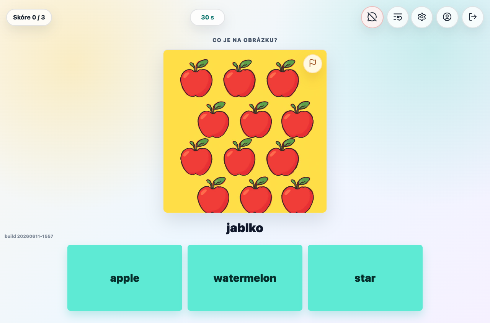
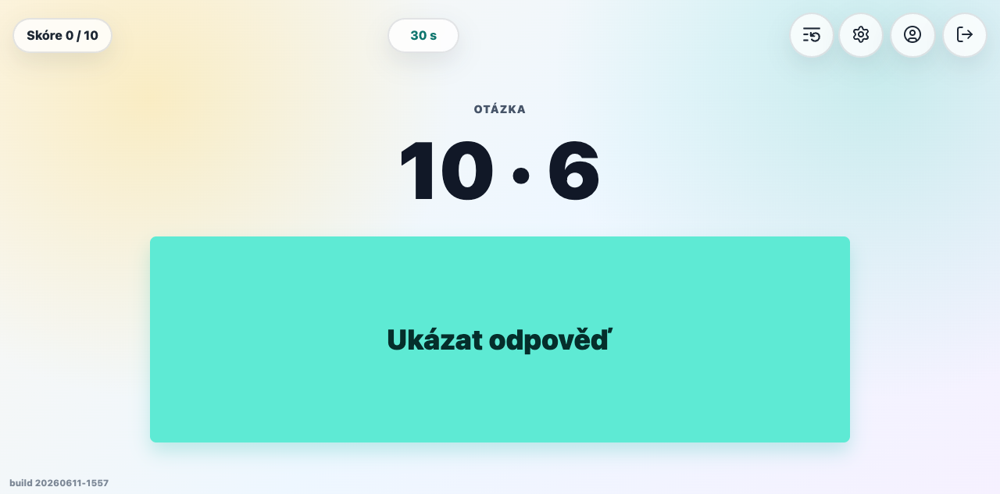

# Kids Quiz

Kids Quiz is a playful web learning app for children. It combines math drills, spelling practice, multilingual flipcards, generated audio, image review tools, and collectible trophy rewards in one browser-based experience for Czech, English, Spanish (Español), and German (Deutsch) learning.

## Screenshots

### Flipcards



### Multiplication



## What It Does

- Practice multiplication, addition, and subtraction with adaptive question selection.
- Learn words through spelling tests and image-based flipcards.
- Use multiple learning languages: Czech, English, Spanish (Español), and German (Deutsch).
- Generate and review flipcard images and audio from the administration screens.
- Report questionable images during tests or from the asset library.
- Collect unique trophy animals after completed tests.
- Sign in with Google OAuth and keep per-user progress, settings, trophies, and visibility preferences.

## Tech Stack

- Frontend: Angular standalone application.
- Backend: Kotlin/Ktor HTTP API.
- Persistence: SQLite.
- Runtime: Docker image serving the backend and built frontend static files.

## Local Development

Build the runtime image context:

```bash
./gradlew stageDockerImageContext --no-daemon
```

Run the staged app locally:

```bash
KIDS_QUIZ_DATA_DIR=.local-data \
KIDS_QUIZ_DB_PATH=.local-data/kids-quiz.sqlite \
KIDS_QUIZ_STATIC_DIR=build/deploy/image-context/public \
PORT=18101 \
java -jar build/deploy/image-context/app.jar
```

Then open [http://127.0.0.1:18101](http://127.0.0.1:18101).

Local secrets such as OAuth credentials and API keys should stay in ignored local environment files and must not be committed.
